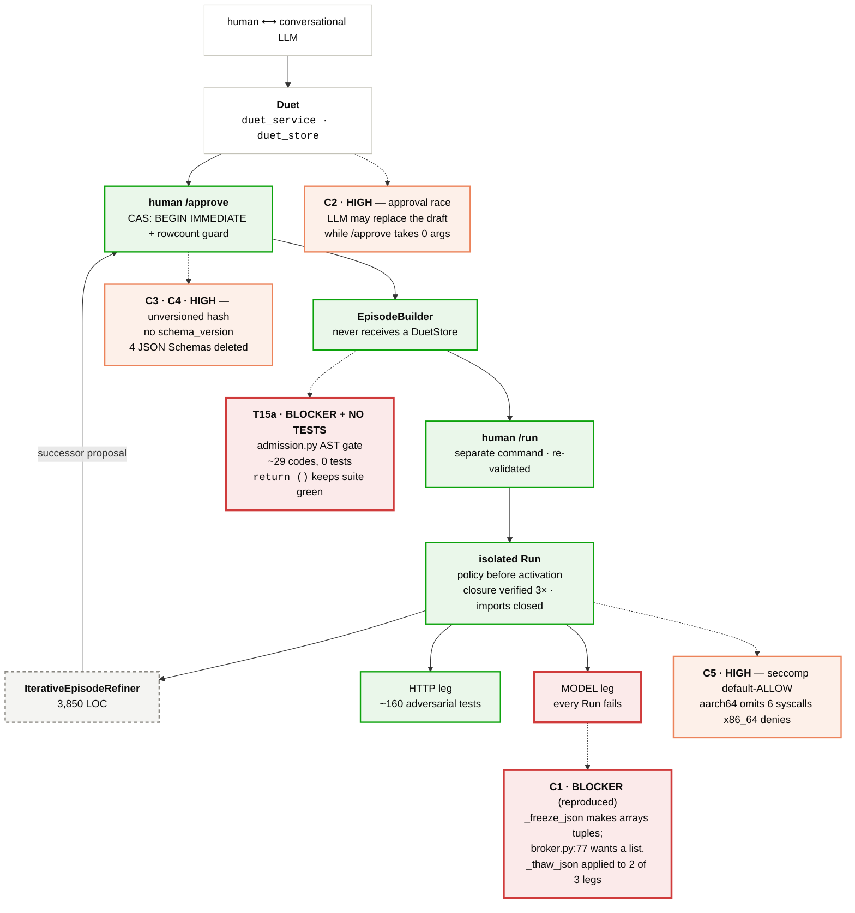
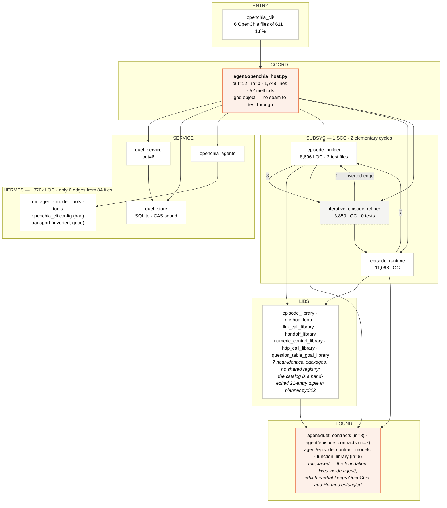

# OpenChia — architecture review diagrams

Measured from the AST import graph at `main @ 6636fd5a6c` (2026-10-02):
**84 OpenChia-layer files · 24 package nodes · 71 cross-package edges.**

Cycle structure computed with Tarjan SCC and `networkx.simple_cycles`:
**one strongly connected component of three packages, containing two elementary cycles.**

Full findings: [`reports/work-261002.openchia.md`](../../reports/work-261002.openchia.md).
A rendered, self-contained version of these diagrams:
[`reports/openchia-architecture.html`](../../reports/openchia-architecture.html).

Severity is always given by **label**, never by colour alone — red and green sit at
ΔE 4.1 under deuteranopia.

---

## 1. Authority pipeline, with defects mapped



Four of the five pipeline stages are verified sound. The defects cluster in two
places: **where human intent is captured**, and **where the newest code landed**.

---

## 2. Static dependency graph



**The two cycles, exactly:**

```
episode_builder → iterative_episode_refiner → episode_builder
episode_builder → iterative_episode_refiner → episode_runtime → episode_builder
```

Both run through the single inverted edge `episode_builder → iterative_episode_refiner`
(3 imports). Break that one and both disappear.

---

## 3. Findings

| Severity | ID | Finding | Evidence |
|---|---|---|---|
| **Blocker** | C1 | No Episode that makes a model call can succeed. Frozen tuple fails the broker's `isinstance(…, list)`; Run finalizes FAILED. *Reproduced.* | `protocol.py:395`, `broker.py:77`, `executor.py:1017` |
| **Blocker · no tests** | T15a | The AST gate blocking `eval`/`exec`/`__import__`/`os.system` in LLM-generated code has ~29 rejection codes and zero tests. `return ()` keeps the suite green. | `episode_builder/admission.py` |
| **High** | C2 | `/approve` approves "whatever is current", not what the human read. The store CAS compares current-against-current and cannot catch it. | `openchia_host.py:521`, `duet_service.py:781` |
| **High** | C3 | The content-hash authority chain has no schema version. One added field silently rehashes every design and invalidates all prior approvals. | no `schema_version`; no `PRAGMA user_version` |
| **High** | C4 | The four JSON Schemas were deleted and never replaced. Zero of six needed specs are machine-checkable. | commit `5baa5a3b7d` |
| **High** | C5 | seccomp is default-ALLOW; aarch64 (the macOS container path) omits six syscalls x86_64 denies, plus `io_uring_setup` on both. | `seccomp.py:170`, `:87-114` |
| **High** | C6 | Authority-critical validation implemented twice — function-selection admission and the `content_id` field lists. | `episode_blueprints.py:137`, `planner.py:357` |
| **No tests** | — | Zero tests import `openchia_host.py`, `episode_contract_models.py`, `iterative_episode_refiner/`, `episode_library/`, `numeric_control_library/`, or the editor. `episode_builder/` is touched by exactly two test files. | verified by import grep |
| **Sound** | — | Approval CAS, builder/approver separation, build→run separation, closure verification, closed import finder, policy-before-activation, terminal-ack phasing. | `duet_store.py:960-1054`, `worker.py:348-356` |

---

## 4. What the graph shows that prose didn't

**The shape is good.** High fan-in sits at the base (`duet_contracts` 8,
`function_library` 8, `episode_contracts` 7) and high fan-out at the apex
(`openchia_host` out=12, in=0). That is a correct dependency pyramid — vocabulary at
the bottom, coordination at the top. Only six edges cross to Hermes from 84 files.

**Three defects are visible as geometry, not opinion:**

- `openchia_host` out=12 / in=0 — it depends on everything and nothing depends on it.
  That is *why* no test imports it: there is no seam to test through.
- The foundation layer physically lives in `agent/`. Moving it to `openchia_contracts/`
  is the one cheap cut that makes the package split tractable.
- The cycle is confined to three packages and one inverted edge.
