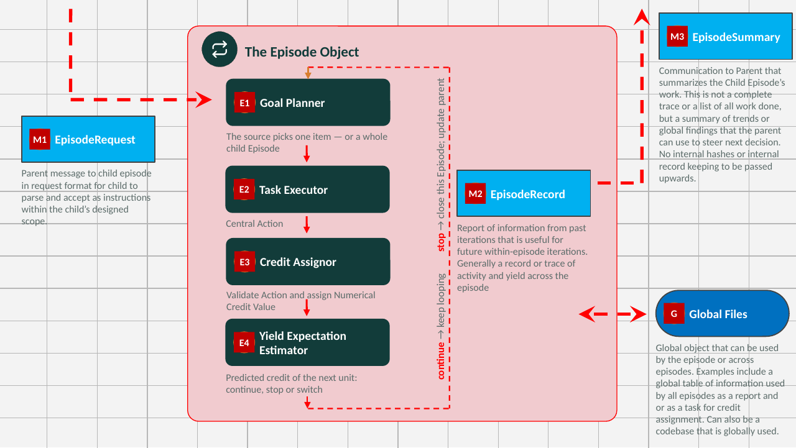
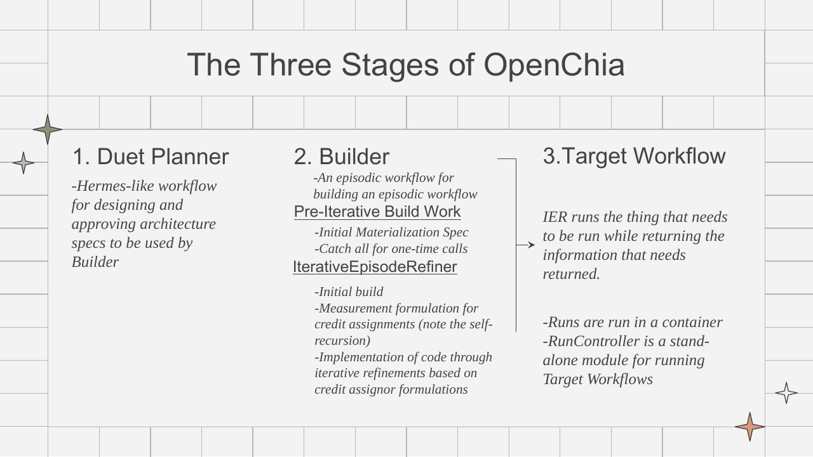
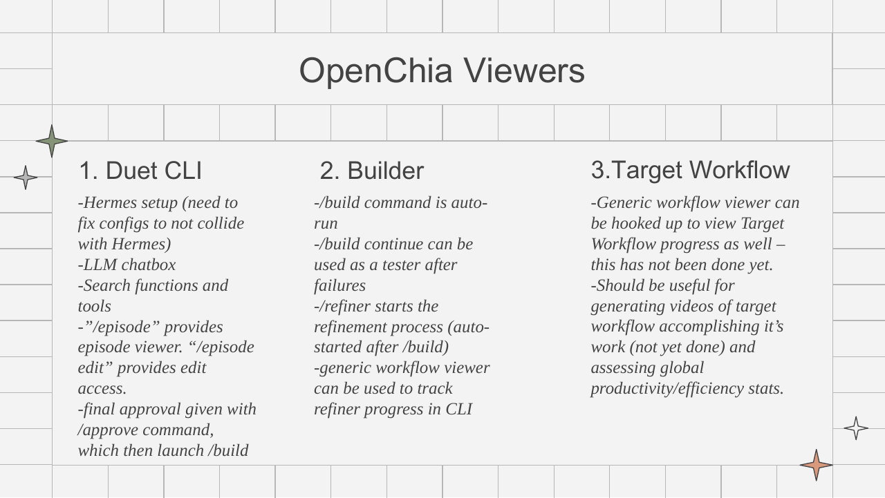
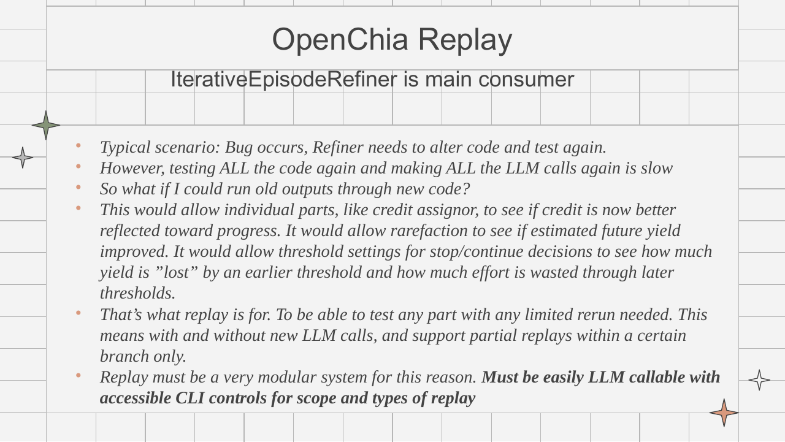
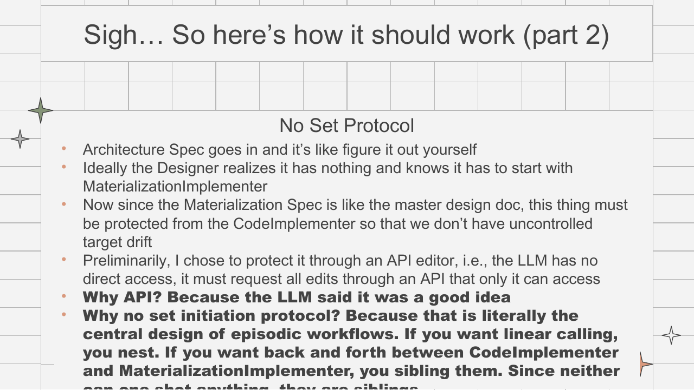
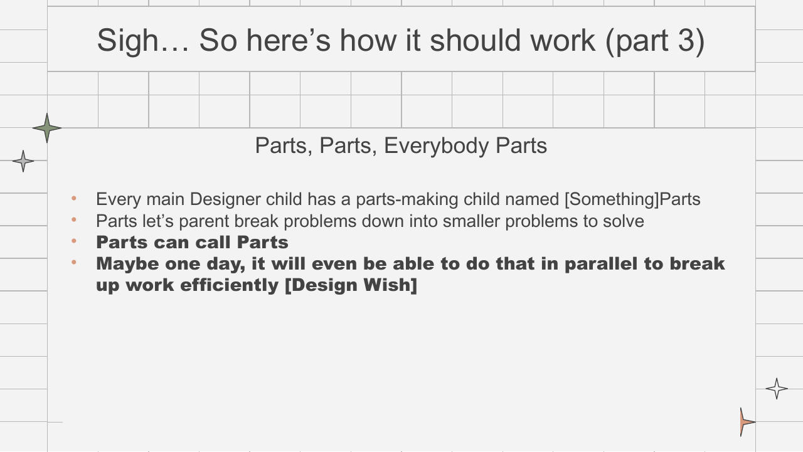
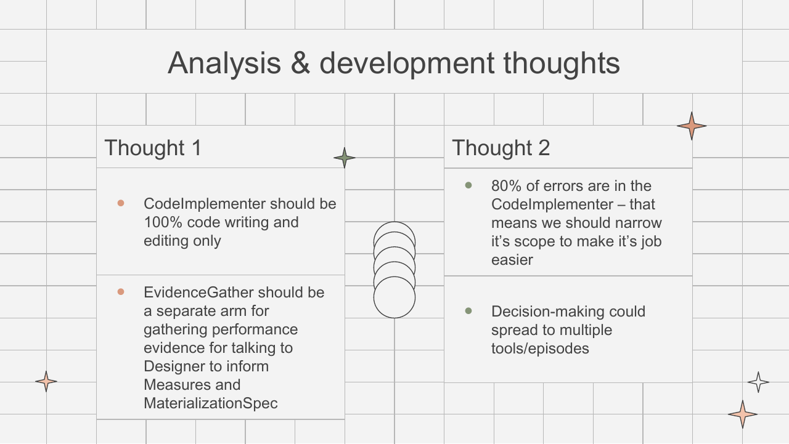

# Design deck vs. written design record: review, 2026-10-08

**Scope.** This compares the OpenChia design deck (`EpisodeDesignDoc.pptx`, 44 slides, about 30 with content) with the repository's written design record:
- ADRs 0001–0010, plus draft ADR 0011 (*Python/Go boundary, all units as CWL tools*), which is not yet committed;
- `OPENCHIA_ARCHITECTURE.md`;
- the `docs/openchia/*.md` write-ups;
- spot checks in code.

It was written against `main` after #66 (refiner-driven construction) and #67 (chat-completions coding adapter). Citations are `path:line`.

**How to read it.**
- *Agrees*: deck and docs say the same thing, possibly in different words.
- *Diverges*: they take different positions, or one is out of date.
- *Deck only* / *Docs only*: no counterpart on the other side.

The action-item checklist is in §7.

## Contents

1. [Summary](#1-summary)
2. [The deck at a glance](#2-the-deck-at-a-glance)
3. [Where the deck and the record agree](#3-where-the-deck-and-the-record-agree)
4. [Where they diverge](#4-where-they-diverge)
5. [Deck-only and docs-only items](#5-deck-only-and-docs-only-items)
6. [The CWL-tool unit approach: what it costs, what we lose, what we gain](#6-the-cwl-tool-unit-approach-what-it-costs-what-we-lose-what-we-gain)
   - 6.1 [The proposal in one paragraph](#61-the-proposal-in-one-paragraph)
   - 6.2 [Gains](#62-gains)
   - 6.3 [Costs](#63-costs)
   - 6.4 [What we lose](#64-what-we-lose)
   - 6.5 [How replay relates to CWL units](#65-how-replay-relates-to-cwl-units)
   - 6.6 [Assessment](#66-assessment)
7. [Action items](#7-action-items)
8. [Appendix: evidence from the 2026-10-07 bring-up](#8-appendix-evidence-from-the-2026-10-07-bring-up)

---

## 1. Summary

The deck and the written record **agree on the core model**:
- an Episode is a controlled loop with numerical credit and a statistical stopping rule;
- Episodes nest;
- the refiner is an Episode workflow with a Designer at the top, peer specialists and a protected Materialization Spec;
- "no set protocol";
- the ASCII CLI exists for the machine as much as for the human.

The deck **lags the code** in several mechanical places, mostly because of #66:
- the build no longer has a pre-iterative pass;
- there are four specialists, not three;
- `/approve` doesn't launch `/build`, and `/refiner` is a viewer, not a starter;
- a container executor exists.

These are slide updates.

There are **three substantive divergences** that need a decision, not a slide edit:
1. **"No native LLM outputs in M1/M2/M3/G"** (slide 10). The record allows model prose and *contains* it structurally (exact fields, no IDs, not authoritative); it does not forbid it.
2. **Replay** (slide 20). The core use case, running old outputs through new code and testing threshold counterfactuals, is explicitly *unsupported* by the replay that exists today.
3. **CWL and Go** (ADR 0003, draft ADR 0011, #62). The deck is silent, yet this direction changes the executor, the unit contract and where the control loop lives.

On the CWL-tool unit approach (§6): **it removes the defect class that dominated the 2026-10-07 bring-up and makes the deck's replay vision tractable**. The price:
- a cross-language hash chain;
- a decision on how units reach models;
- a TLS-terminating broker;
- per-unit container overhead;
- the loss of the single-process, inspectable Python module.

The recommended path is the one draft ADR 0011 already stages. First, implement `cwl_tool` units **in Python**, inside today's runtime (#62), and measure what fraction of real units fit. Defer any Go migration until that number is known.

## 2. The deck at a glance

The Episode object (slide 9) is the deck's central diagram:

Slide 9 shows E1–E4 inside the loop, the numerical controller implied by continue/stop, and M1 (request), M2 (record), M3 (summary) and G (global files).

The three stages and the viewers (slides 17–18):

Replay (slide 20):

Refiner structure (slides 28–30, 35):

- Slide 28: the Designer is the boss Episode. It chooses among MaterializationImplementer, Measure and CodeImplementer, each with sub-Episodes. Question and Support are global leaves.

The deck's key concepts, quoted:
1. **Sanitize message-passing inputs.** M1, M2, M3 and G must not contain native LLM outputs (slide 10).
2. The planner may gather information to formulate a goal JSON (slide 11).
3. The goal JSON must be **directly** relatable to credit assignment (slide 12).
4. Credit = LLM judge to JSON, then a deterministic numeric conversion (slide 13).
5. Yield estimation is the key control: a statistical estimator of expected future credit (slide 14).
6. The parent doesn't need everything the child knows; 100–1000× compression has been productive (slide 15).
7. The ASCII CLI is for the machine (slide 19).
8. Libraries and examples funnel open-endedness into rapid design (slide 31).
9. Communication is the key: put the right information in the right places (slide 32).
10. Nest for ordered processes where each step needs iteration (slide 33).
11. Use siblings for decision forks and interleaved tasks in unknown order (slide 34).

## 3. Where the deck and the record agree

| Topic | Deck | Written record |
|---|---|---|
| Episode anatomy | E1 goal planner, E2 executor, E3 credit, E4 yield estimator, plus a numerical controller | `goal / unit / result / progress / stopping` plus `numeric_control{rarefaction, continuation}`. Rarefaction is E4 and continuation is the controller. The source "picks one item or a whole child Episode" exactly (`agent/episode_contract_models.py:656-672`, `method_loop/episode.py:974-977`, ADR 0003:47-64) |
| Nesting | Episodes nest | ADR 0003:29-35 |
| Credit is numeric and deterministic | LLM judge → deterministic numeric | "Raw text and model-authored scalar ratings never enter numerical control directly" (`epistemic_yield.md:53-54`). Refiner credit comes from host-admitted milestones, not model-rated quality (`iterative_episode_refiner_contracts.md:989-1000`) |
| Goal relatable to credit | Directly | `EpisodeGoal.result_contract`; credit per Episode on its own scale, never summed across children (ADR 0003:59-69) |
| Yield estimation | A statistical estimator | `numeric_credit_intervals.md:3-6, 26-32` |
| Global files (G) | A global table or codebase | `question_table_goal_library`: one global table with read-only, Episode-scoped views |
| No set protocol | The Designer figures it out | `iterative_episode_refiner_episodes.md:38-42` |
| Question and Support | Global leaves | `iterative_episode_refiner_episodes.md:49-55` |
| Materialization Spec protection | API editor only | Only MaterializationImplementer and its Parts submit structured operations; read-only for the Code Implementer (`iterative_episode_refiner_episodes.md:222-227`) |
| Parts call Parts | Yes | Same specialty only, each child narrowing scope (`iterative_episode_refiner_episodes.md:104-112`) |
| Siblings for interleaving (slide 34) | Yes | Cross-specialty back-and-forth goes through the Designer, between peers (`iterative_episode_refiner_episodes.md:120-123`) |
| Refiner uses a coding agent | Codex or Claude Code | ADR 0009. Since #67 there is also a plain `chat_completions` adapter (Argo) |
| ASCII CLI for the machine | Yes | `openchia refiner … --json/--plain` "for repeatable agent inspection" (`refiner_terminal_viewer.md:85-115`) |
| Libraries and examples | Key | Support finds reference Episodes; reference Episodes are evidence, not authority (`duet_owned_episode_design.md:51-53`) |

## 4. Where they diverge

| # | Topic | Deck | Written record and code | Resolution |
|---|---|---|---|---|
| D1 | **LLM output in messages** | M1, M2, M3 and G **must not** contain native LLM outputs (slide 10) | Prose is *allowed and contained*. Assignments carry goal text written by the parent (`iterative_episode_refiner_episodes.md:137-148`). The iteration history includes proposal text "as historical data" (`episode_communication.md:88-91`). Reports are model syntheses and are conceded not to be proven injection-free (`episode_communication.md:258-262`). Principle 17 is closer to the deck but not implemented (`iterative_episode_refiner_principles.md:140-144`) | **Decide the policy.** Either the slide is restated as "exact-field, ID-free, non-authoritative prose only", or the docs and code tighten toward closed records (`ParentRequest` is already instruction-free: `handoff_library/contracts.py:347-357`) |
| D2 | **Message names** | M2 "EpisodeRecord" = within-episode memory; M3 "EpisodeSummary" | `EpisodeRecord` is the full recursive audit trace and is deliberately kept out of the running view (`method_loop/episode.py:13-19, 616-628`). The memory is `iteration_history`. The parent report is `ParentReport` against a parent-declared `ReportContract` (`method_loop/communication.py:52-90`) | Update the slide to the code names. M2's current name means the opposite in code |
| D3 | **Goal planner** | E1 re-plans a "goal JSON" | The goal is approved and immutable per invocation (`EpisodeGoal`, `method_loop/episode.py:180-192`). Per-unit choice belongs to the source, and `EpisodeCreationSpec.goal` is text | Update the slide: E1 is the *unit source*; the goal is fixed |
| D4 | **Specialists** | Three: MaterializationImplementer, Measure, CodeImplementer | **Four**, adding **Verify** with Verification Parts (`iterative_episode_refiner_episodes.md:3-36`, `function_library/refinement_contract.py:47-52`) | Update the slide. Verify is also the natural home for slide 35's "EvidenceGather" |
| D5 | **Build stages** | Builder = pre-iterative build work (initial Materialization Spec, initial build), then the refiner | After #66 there is no pre-iterative pass: the refiner constructs from the approved Architecture (`iterative_episode_refiner/construction.py:1-6`). ADR 0007:31-33, `OPENCHIA_ARCHITECTURE.md:14-39`, `duet_owned_episode_design.md` and `codebase_design_draft.md` still describe the old flow | Update the slide **and** those docs |
| D6 | **Command flow** | `/approve` launches `/build`; `/build` auto-runs; `/build continue` is a tester; `/refiner` starts refinement | `/approve` records approval only (`openchia_cli/openchia_commands.py:379-393`). `/build` is explicit and refinement runs *inside* it (ADR 0007). `/build continue` resumes an interrupted job (`build_continuation.md:3-13`). `/refiner` is a read-only viewer (`refiner_terminal_viewer.md:3-5`). The deck omits `/run`, `/code`, `/launch`, `/decline`, `/stop` and `openchia test` | Update the slide |
| D7 | **Containers** | "Runs are run in a container" (slide 17) vs "Does it have one? No" (slide 37) | Both are half-right. A container executor exists (`episode_runtime/container_executor.py`), and the 2026-10-07 successful Run used it. On Linux the selector prefers systemd when available (`episode_runtime/executor_selection.py:31-34`). ADR 0005 makes containers the decided default, but that switch is pending. ADR 0010 adds per-candidate environments | Update slides 17 and 37 |
| D8 | **Replay** | Run old outputs through new code; test credit, rarefaction and thresholds counterfactually; partial branch replay, with or without new LLM calls (slide 20) | Recorded playback without LLM calls, numerical replay and branch scoping exist (`unified_episode_test_harness_design.md:880-905`). But replay **requires the recording's exact admitted build**, and counterfactual controller settings on a changed build are unsupported (`…:905-917`) | **Decide.** Adopt the deck's use case as a requirement (see §6.5) or narrow the slide |
| D9 | **Nesting semantics** | Nest for ordered processes (slide 33) | Nest by outcome ownership and scope narrowing. "A serial stage need not be a new Episode"; ordered steps are prerequisites (`iterative_episode_refiner_principles.md:122-132`) | Update the slide. Also fix principle 14 ("Parts … sit above the Designer"), which `iterative_episode_refiner_episodes.md:10-11` supersedes |
| D10 | **Code Implementer scope** | Should be 100% code writing (slide 35) | It also samples local checks, can request `evaluate=true` and edits the environment recipe (`iterative_episode_refiner_episodes.md:195-199, 225-227`) | Discuss. This is a design choice, not drift |
| D11 | **Support vs Question** | Support reads docs and code; Question searches the web | Both have `web_search`, `read_url`, `library_search`, `read_library` and `read_candidate`. Question also independently reviews checking programs (`iterative_episode_refiner_episodes.md:158-175`) | Update the slide |
| D12 | **Hermes rename** | `.hermes`/`HERMES_*` renamed to avoid clashes | The default home is still `~/.hermes` (`hermes_constants.py:50-58`). Slide 18 itself says "need to fix configs" | Track as an open item |

## 5. Deck-only and docs-only items

**Deck only (no written counterpart):**
- 100–1000× child→parent compression (slide 15). The docs give only real 6–8 KB report sizes.
- "80% of errors are in the CodeImplementer" (slide 35). The 2026-10-07 evidence (§8) instead puts the dominant defect class in **generated wiring**, which the builder emitted, not the Code Implementer.
- A standalone `RunController` (slide 17). Runs go through `/run` and `RunExecutor`, and ADR 0005:51-52 forbids a refiner-specific runner.
- Parallel Parts (slide 30), a wish. `method_loop` has no concurrency.
- Hermes "learning" (slide 39). Global learning promotion is rejected pending approval (`epistemic_yield.md:40-41`).

**Docs only (a deck reader should know these):**
- `ReportContract`: the parent declares the report shape before launch (`episode_communication.md:11-12, 46-52`).
- ADR 0002: **Run HTTP is host-brokered**, and credentials never enter the Run. This was proven end to end on 2026-10-07.
- ADR 0003 / draft ADR 0011 / #62: CWL as the inner execution layer, and the proposed Python/Go split.
- ADR 0004: interpret the Episode wiring instead of emitting it.
- `/code`: human-directed coding across Architecture, materialization and source (`workflow_coding_conversation.md`).
- ADR 0009 + #67: coding adapters for Codex, Claude Code and plain chat completions (Argo).

## 6. The CWL-tool unit approach: what it costs, what we lose, what we gain

### 6.1 The proposal in one paragraph

An Episode's **unit** becomes a declared CWL `CommandLineTool` invocation: descriptor hash + image digest + per-unit job object, plus a declarative projection from tool outputs to the unit's typed record and credit identities. The host interprets the Episode wiring (ADR 0004), and the model writes no module.

Draft ADR 0011 extends this to **every** unit. Generated logic becomes a standard-library Python *script* run in a digest-pinned container (`read job JSON → work → write cwl.output.json`). Static AST admission is replaced by a build-time smoke run (#64).

Execution uses GoWe's CWL v1.2 engine (378/378 conformance). Isolation and egress stay with OpenChia: a hardened container, network only through the host broker, and credentials injected per rule. The hardening GoWe needs is tracked in wilke/GoWe#277.

### 6.2 Gains

| Gain | Why | Evidence |
|---|---|---|
| **Removes the dominant defect class** | Every Run failure in the 2026-10-07 bring-up was in generated wiring: imports, constructor and function signatures, JSON binding arguments, channel IDs, the Leaf callback protocol, credit-observation shape, `ClosedRecord`. None was in task logic. Under CWL the host owns all of that wiring | §8; #51, #54, #59, #60 |
| **Small, reviewable approval surface** | A human approves a ~20-line descriptor, image digest and projection instead of a ~2,400-line module | the 2026-10-07 module: 2,367 lines, ~30 of task logic |
| **Isolation by construction** | Tool code runs in its own process and image and returns only declared outputs. It is never imported into the process that records evidence and credit | ADR 0011 "isolation by construction beats isolation by inspection" |
| **Re-executable outside OpenChia** | Any CWL runner can rerun a unit from the descriptor, image and job object | ADR 0011, #62 |
| **One unit kind, one evidence shape** | `Task = Tool + Job + RuntimeHints` for curl probes, BV-BRC tools and generated scripts alike | ADR 0011 "One unit kind, not two" |
| **Reuse of existing tool descriptors** | BV-BRC, Dockstore and bio.tools descriptors become Episode units without wrappers | #62 |
| **Dynamic admission** | A smoke run tests behaviour, not shape, and catches a whole defect class at once. The prototype found five defects in under a minute, then passed the final module before its successful Run | #64 |
| **Replay becomes tractable** | See §6.5 | |

### 6.3 Costs

| Cost | Size | Notes |
|---|---|---|
| `cwl_tool` unit kind in Python (#62) | Medium | Contract fields, a host-side interpreter for the wiring, a projection language, evidence recording |
| **How units reach models** | Design decision, blocking | A tool with no network can't call a model. Draft ADR 0011's answer: model calls happen host-side *between* units. Some Episodes then need more units (draft ADR 0011 OQ1) |
| **Broker as egress proxy with TLS termination** | Medium–large | A plain HTTPS proxy sees only `CONNECT host:443`, so path rules (ADR 0002) would be unenforceable without a TLS-terminating broker with a pinned internal CA (draft ADR 0011 OQ2) |
| **Projection language** | Small–medium | CWL JS needs a sandboxed, time-bounded engine (goja is currently unbounded; GoWe#277). The alternatives are a restricted JSONPath subset or registered library functions |
| **Container start per unit** | ~100–500 ms per unit | Irrelevant for genome annotation, significant in tight probabilistic loops. Needs warm containers or "cheap units stay host-side" (draft ADR 0011 OQ4) |
| **GoWe hardening** | Medium | Secrets off argv, server-assigned network, bounded JS, proxy passthrough, digest provenance (GoWe#277). Shared with GoWe's own deployments |
| **If the Go split proceeds (draft ADR 0011 stages 1, 3, 4)** | Large | Cross-language hash chain: a written wire spec, `schema_version` on 7 chain records (#58), a golden hash corpus as a conformance suite. Plus porting the provider handling (Argo streaming, timeouts) and a hash-continuity decision |

### 6.4 What we lose

- **Interleaving tool work and reasoning within one unit.** Today a generated unit can call a model mid-computation. Under "model calls between units" that becomes two or more units, with more controller steps and more evidence.
- **Single-process inspectability.** Today one Python module holds the whole Episode, can be dry-run in-process (as done on 2026-10-07) and debugged with a stack trace. CWL units add process, container and serialization boundaries; failures surface as exit codes and logs.
- **Python-native typing at the unit boundary.** Records cross as JSON, so the closed Python types (`ClosedRecord`, `CreditObservation`) are rebuilt host-side from projections. That is safer, but less expressive for complex goal-state logic, which must become registered library functions.
- **Path-level egress guarantees, unless the broker terminates TLS.** The current typed broker (`http_call_library`) sees method, host and path. A generic proxy doesn't.
- **Latency headroom** for cheap, high-frequency units.
- **Freedom in generated code.** Draft ADR 0011 requires generated scripts to be **standard-library only**. Anything needing an OpenChia abstraction must become a registered library function.
- **During migration, simplicity.** Running a partial `cwl_tool` adoption, the Python emitter and (optionally) a Go runtime at once is worse than any of them alone. Draft ADR 0011 calls this out explicitly.

### 6.5 How replay relates to CWL units

The deck's replay (slide 20) asks for three things:
1. run **old outputs through new code** (credit, rarefaction, thresholds);
2. partial reruns within a branch;
3. with or without new LLM calls.

Today's replay requires the **exact recorded build**, and a mismatched request fails instead of reusing an old response (`unified_episode_test_harness_design.md:905-917`). The reason is structural. In the emitted-module design, unit execution, wiring and controller code are one artifact, so any code change invalidates the whole recording.

CWL units **separate what changes from what is recorded**:

| Replay need | Emitted module (today) | CWL units |
|---|---|---|
| New controller code (credit, rarefaction, thresholds) over old outputs | Unsupported: the build hash changed | **Natural.** Unit outputs are keyed by `(descriptor hash, image digest, job object hash)`. A controller change doesn't change any unit key, so all recorded outputs replay and only the host-side controller reruns |
| Changed tool in one place | The whole build is invalid | **Cache invalidation by key.** Only units whose descriptor or image changed miss and rerun. Units downstream rerun only if their *job object* changes, i.e. if the changed output actually feeds them |
| With or without new LLM calls | All or nothing per recording | Model calls are host-side between units (draft ADR 0011), recorded by request hash. Replay can serve them from the recording or call the model, per branch |
| Partial branch replay | Exists, on the same build | The same scoping plus per-unit cache keys, so it works across builds |
| Threshold what-ifs ("yield lost vs effort wasted") | Unsupported on changed settings | Rerun only continuation/rarefaction over the recorded unit stream with new parameters. This is pure numerics |

**Caveats:**
- **Divergence.** When a change alters a unit's output, every downstream job object changes, so the counterfactual trajectory needs real execution from that point. The replay system should report the divergence point rather than hide it.
- **Non-deterministic tools.** These need recorded outputs to be authoritative (attest rather than reproduce, ADR 0003), so CWL's reproducibility is "rerunnable", not "bit-identical".
- **External HTTP.** For units calling external services, the broker must also record responses (a cassette) for offline replay.

Net: the deck's replay vision is hard to deliver on emitted modules, and it largely falls out of the CWL unit boundary once units are keyed by content hash.

### 6.6 Assessment

- **Do now:**
  - #62's `cwl_tool` unit kind, **in Python**, inside today's runtime;
  - the build-time smoke run (#64);
  - decide draft ADR 0011 OQ1 (model calls between units) and OQ2 (TLS-terminating broker) first.

  Then **measure** what fraction of real Episode units fit (draft ADR 0011 OQ3). Stage 2 of draft ADR 0011 is exactly this, and it is the cheaper alternative ADR 0011 itself endorses as the correct first step.
- **Do in parallel:** GoWe hardening (GoWe#277), which pays off for GoWe's own deployments regardless.
- **Decide later, on data:** moving the executor, builder or planner to Go. The cross-language hash chain is the largest single cost and should be taken on only if coverage is high.

## 7. Action items

**Deck updates (owner: deck author)**
- [ ] D2/D3: rename M1/M2/M3 to `EpisodeRequest` / `iteration_history` / `ParentReport` (+ `ReportContract`); E1 is the unit source and the goal is fixed per invocation.
- [ ] D4: add **Verify** as the fourth specialist, and map slide 35's EvidenceGather onto it.
- [ ] D5: remove the "pre-iterative build work" stage (post-#66).
- [ ] D6: fix the command flow (`/approve`, `/build`, `/build continue`, `/refiner`); add `/run`, `/code`, `/launch`, `/stop`.
- [ ] D7: reconcile slides 17 and 37 on containers (systemd and container executors, ADR 0005 default pending, ADR 0010 environments).
- [ ] D9/D11: restate nesting as ownership plus scope narrowing; correct Support vs Question tools.
- [ ] Add slides for ADR 0002 (brokered HTTP), ADR 0003/0004 and the CWL/Go direction (#62, draft ADR 0011).
- [ ] Revisit slide 35's "80% of errors in CodeImplementer" against the 2026-10-07 evidence (§8).

**Design decisions (owner: maintainers)**
- [ ] D1: the LLM-output policy for M1/M2/M3/G, then align `episode_communication.md`, principle 17 and the code.
- [ ] D8: adopt counterfactual replay ("old outputs through new code") as a requirement, or narrow slide 20. If adopted, key unit outputs by content hash (§6.5).
- [ ] Draft ADR 0011 OQ1: how units reach models (proposed: host-side between units).
- [ ] Draft ADR 0011 OQ2: egress for CWL units (TLS-terminating broker vs typed broker only).
- [ ] Commit draft ADR 0011 (currently untracked) once reviewed.

**Docs fixes (owner: maintainers)**
- [ ] ADR 0007:31-33, `OPENCHIA_ARCHITECTURE.md:14-39, 184-199`, `duet_owned_episode_design.md`, `codebase_design_draft.md`: describe the post-#66 refiner-driven construction.
- [ ] `iterative_episode_refiner_principles.md` #14: Parts placement (superseded by `iterative_episode_refiner_episodes.md:10-11`).
- [ ] D12: finish the `.hermes` → OpenChia home rename, or document why not.

**Engineering (tracked issues)**
- [ ] #62: `cwl_tool` unit kind (Python first) and a coverage measurement.
- [ ] #64: build-time smoke run in the container executor.
- [ ] #63: give the planner the library type surface; make verification-only findings non-blocking.
- [ ] #57 / #61: refiner lease and Run-observation behaviour. With #67 the Code Implementer now runs on Argo; verify a full refiner build on Argo.
- [ ] #65: `/run` display bugs.
- [ ] wilke/GoWe#277: isolation hardening (secrets, network policy, bounded JS, proxy egress, digest provenance).
- [ ] #58: `schema_version` on chain records, blocking for any cross-language step.

## 8. Appendix: evidence from the 2026-10-07 bring-up

The probe Episode `asm_next_broker_probe` made two authenticated GETs to the BV-BRC RAGstack asm-next tenant through the host broker. It reached a successful Run (`run_68aaa714…`) after these fixes, every one of them in **generated wiring**:

| Run | Failure | Fix |
|---|---|---|
| 6 | Binding arguments not JSON | #51 |
| 7 | Credit columns built from channel names, not stable IDs | #54 |
| 8 | `compose_controller(credit=…)`: wrong keyword names, integer epoch | #59 |
| 9 | `Leaf.result` arity, plus four latent defects: `Leaf.unit` was a function, labels used as identities, missing columns in the credit observation, a dict instead of a `ClosedRecord` | #60 |
| 10 | **Succeeded.** Both probes 200; `credential_acceptance: accepted`; the credential absent from all 17 Run records | — |

Two practices made the difference. A local dry run of the sealed package (real linker, fake broker) found the five Run 9 defects in under a minute; the same harness passed the final module before the real Run. Static checks were added one defect at a time (#22, #54, #59, #60). Both point to the conclusions of §6: own the wiring in the host, and admit dynamically.

---

*The deck and slide images are from `EpisodeDesignDoc.pptx` (OpenChia design docs). Only the slides discussed are reproduced, under `figures/design_deck/`. The deck is built on a Slidesgo template; the source `.pptx` is not committed.*
