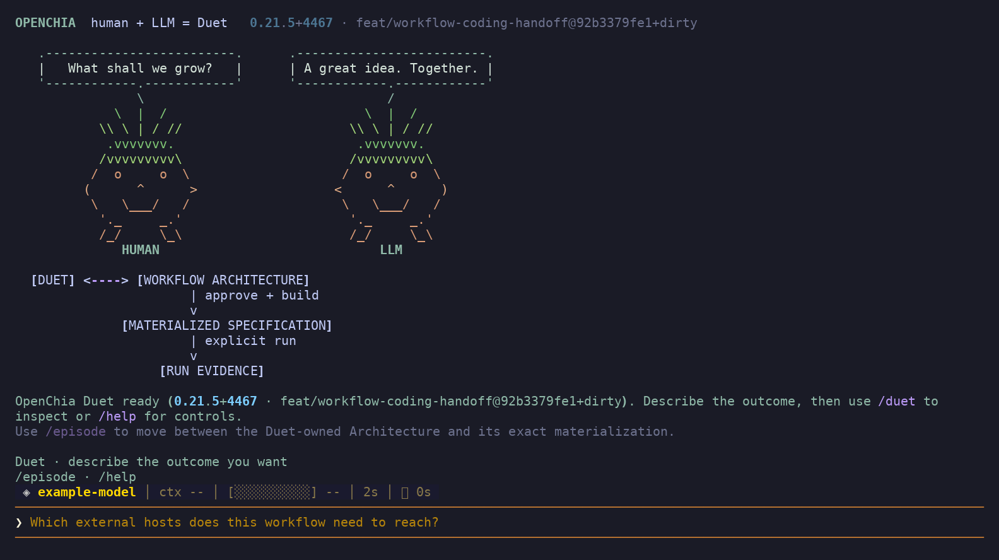
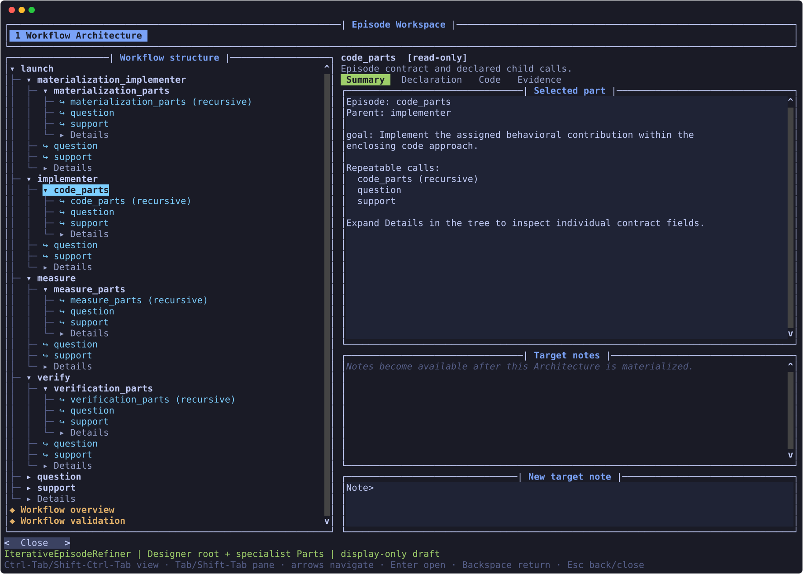

# OpenChia terminal figures

The Duet was captured on 2026-10-07 and the Episode viewer updated on 2026-10-08
from the working checkout. The Duet PNG is ready to insert into documents; SVGs retain scalable text
and color. Plain-text exports support searching and inspection.

| Figure | PNG | SVG | Text |
|---|---|---|---|
| Duet startup and ChiaPet conversation | [duet.png](duet.png) | [duet.svg](duet.svg) | [duet.txt](duet.txt) |
| Episode viewer with the IterativeEpisodeRefiner architecture | — | [episode_viewer.svg](episode_viewer.svg) | [episode_viewer.txt](episode_viewer.txt) |

## Duet



The production Duet banner and prompt layout are shown with an example model
label. No model request was made. The artwork is part of the CLI startup banner
and has a compact form for terminals narrower than 64 columns.

## Episode viewer



This is the real IterativeEpisodeRefiner architecture from
[`refinement_workflow_spec()`](../../../iterative_episode_refiner/design.py),
not an invented example. It describes the Refiner itself, rather than a particular
Target Workflow being repaired or a live tree of assignments.

The template placement is:

```text
launch (Designer entry point)
|-- materialization_implementer
|   `-- materialization_parts
|-- implementer (Code Implementer)
|   `-- code_parts
|-- measure
|   `-- measure_parts
|-- verify
|   `-- verification_parts
|-- question
`-- support
```

`launch` uses the Designer role with the launch request admission. The four
specialists are peers, and each owns its own task-specific Parts template.
Question and Support are shared leaves available to Designer, every specialist,
and every Parts template. The tree places each template in one concrete home;
it is not a sequence of execution. See the
[approved Episode design](../iterative_episode_refiner_episodes.md) for the
ownership and capability boundaries.

| Role | Responsibility |
|---|---|
| Designer (`launch`) | Choose and revise the general approach until the approved Target Workflow meets its requirements. |
| MaterializationImplementer | Realize the Designer's approach in the assigned Materialization Spec. |
| Code Implementer (`implementer`) | Change the candidate against the parent's fixed implementation measure. |
| Each specialist's Parts | Perform a scoped contribution within that specialty, or delegate a smaller instance of the same Parts specialization. |
| Support | Find applicable, source-linked guidance for the caller's named gap. |
| Question | Resolve uncertainty that affects the caller's next decision. |
| Measure | Supply a reusable measuring function for the requested requirements. |
| Verify | Independently check the exact candidate against the parent's requirements. |

**Workflow structure is the navigation tree on the left.** Select an Episode
to read its goal, child calls, and exact declaration in the right pane. The
capture has the specialist branches expanded and `code_parts` selected.

- Click an Episode name to read its details; click its triangle or use
  **Enter / Right** to expand it. **Left** collapses it or moves to its parent.
- **Details** expands the individual contract fields, including Goal, Result,
  Numerical control, and Reference Episode. These fields retain their existing
  edit and note permissions.
- Cyan **↪** rows are declared repeatable calls. Selecting one shows its call
  contract and the called Episode's goal. Click its arrow or press **Enter / Right**
  to visit that Episode; **Backspace** returns to the call and restores the
  detail page and tree position. Recursive calls remain finite links.
- **Workflow overview** and **Workflow validation** appear below the tree.
  Overview's **Declaration** contains the complete architecture JSON.

Each specialist can call Question and Support; each Parts template can call
itself recursively and use those same two helpers. Designer's specialist and
helper calls, and each specialist's own Parts call, appear as nested children.

The editable [architecture JSON](example_architecture.json) is an exact export
of the registered specification, including numerical controls, library
references, and call adapters. The [persisted viewer snapshot](episode_architecture_snapshot.json)
contains the host-created identity, hashes, revision, configuration, and
validation results consumed by the viewer.

For this capture, the host persisted a copy as a ready architecture draft with
no validation deficits in an isolated temporary profile. This copy was not
human-approved, built, or executed. The viewer therefore
correctly reports that materialization is required before target notes become
available.

## Capture method

These are captures of actual terminal renderers, not operating-system window
screenshots. This session could not access the desktop display or start a
graphical display server.

The Duet uses the production `OpenChiaCLI.show_banner()` output and its real
prompt-toolkit layout. The Episode view uses the production Episode Workspace
application with a real snapshot persisted by `OpenChiaHost` in an isolated
temporary profile. Both prompt-toolkit applications were rendered with scripted
input on a 128-column, 44-row surface for the Duet and a 144-column, 50-row
surface for the updated Episode viewer so the expanded hierarchy and call links
fit. The Duet export
omits unused trailing rows from its non-full-screen prompt area.

PNG output renders the recorded terminal text and cell styles in DejaVu Sans Mono
on a dark background. SVG output is the same captured content exported through
Rich. Capture did not contact a model provider, start a build or Run, or restart
the user's active session.
